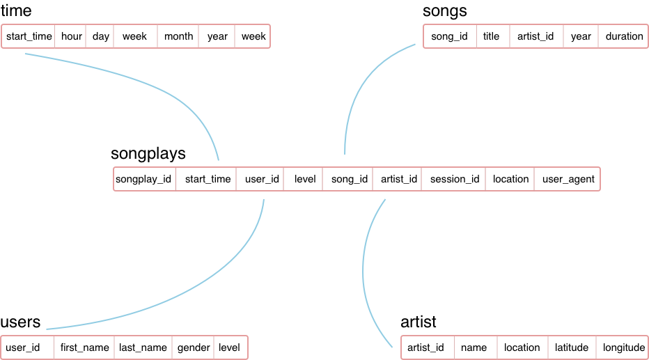

# Data-Lakes-with-Spark
Building a Data Lake and an ETL pipeline in Spark that loads data from S3, processes the data into analytics tables, and loads them back into S3.

## Database
The database ```sparkify``` consists of 5 tables consisting fact and dimension tables.

There is one fact table : 

```songplays``` 

and four dimension tables:
```
1. users
2. songs
3. artists
4. time
```



## Directory Structure

    ├── README.md
    ├── etl.py
    ├── data
        └── log_data
          └── 2018-11-01-events.json
          └── 2018-11-012-events.json
           .
           .
          └── 22018-11-30-events.json
        └── song_data
         └── A
          └── A
           └── A
             └── A
             └── B
             └── C
           └── B

The data folder in the directory can be used for testing purposes on the local machine, however, to work on full-scale data the user must replace the ```input_data``` and ```output_data``` values to their S3 bucket locations respectively.

## Running the Project

Step 1: For the code to run on the cloud cluster, one must first subsititute their AWS User credentials in the ```dl.cfg``` file replacing values for ```AWS_ACCESS_KEY_ID``` and ```AWS_SECRET_ACCESS_KEY```

Step 2: Next step is for the user to replace the ```input_data = s3://udacity-dend``` and ```output_data=<Your S3 bucket location>``` locations in the ```etl.py``` file.

Step 3: In a terminal, run ```run.sh``` to execute the pipeline file, conversely, if you need to modify the job hardware requirements you can change them in the ```run.sh``` file.


